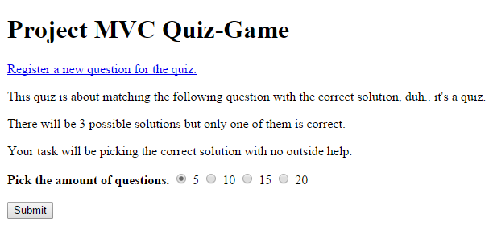
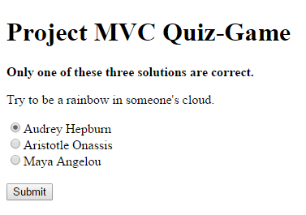
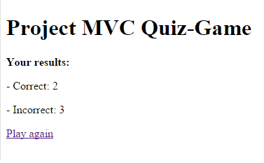
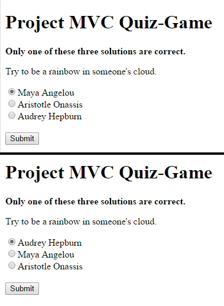
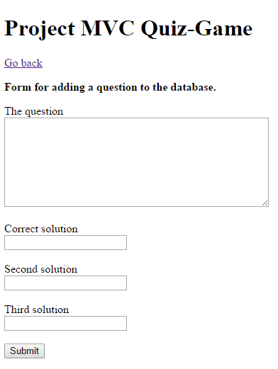
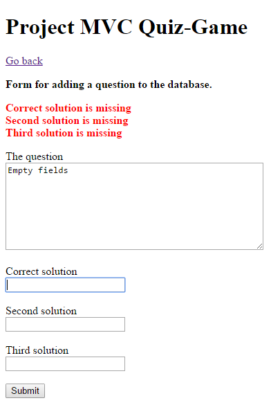
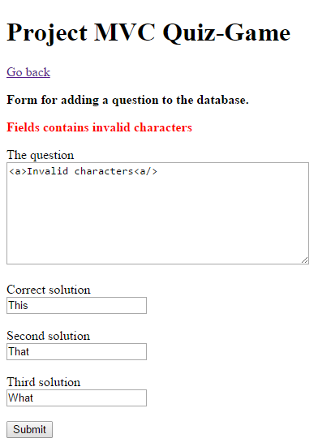
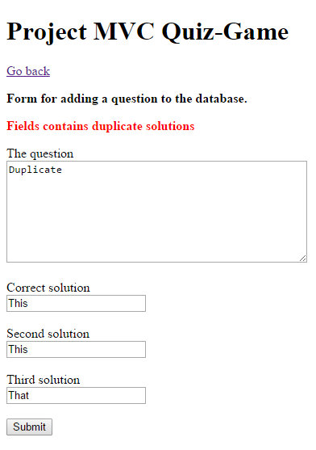
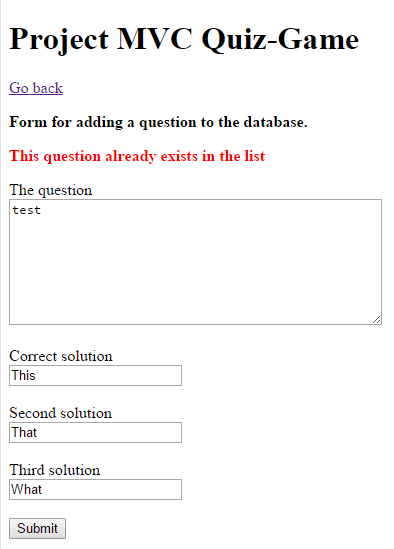
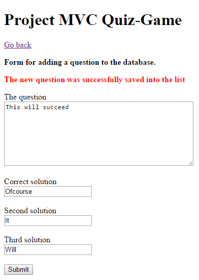

#Test cases

##Test case 1.1: Navigate to page 
Normal navigation to page, game setup is shown.

###Input:
- Navigate to site.
 
###Output:
- The text "Project MVC Quiz-Game", is shown
- A link named "Register a new question for the quiz", is shown
- Basic quiz instructions is shown
- Four radio buttons for amount of questions is shown
 

***

##Test case 1.2: Start a new game
Play through a normal session with any amount of questions

###Input:
 * Test case 1.1: Navigate to page
 * Press user choice of amount of questions
 * Press "Submit" button
 
###Output:
- The text "Project MVC Quiz-Game", is shown.
- A question is shown
- Three radio buttons with solutions is shown
- A submit button is shown

***

##Test case 1.3: Finish a game
Pick a solution and press the submit button until game is over

###Input:
- Test case 1.2: Start a new game
- Press user choice of solution
- Press "Submit" button
- Repeat step 2 and 3 until game is over (total limit of questions have been reached)
 
###Output:
- The text "Project MVC Quiz-Game", is shown.
- Your results is shown, total of correct and incorrect answers
- A link named "Play again" is shown

***

##Test case 1.4: Play another game
Pick a solution and press the submit button

###Input:
- Test case 1.3: Finish a game
- Press the link "Play again"
 
###Output:
- Test case 1.1: Navigate to page, is shown

***

##Test case 2.1: Random questions
Questions are being picked at random

###Input:
- Test case 1.3: Finish a game
- Inspect the questions
- Test case 1.3: Finish a game

###Output:
- Each game has a different question list and you "almost" always get a different pattern

***

##Test case 2.2: Random solution orders
The same question do not necessary have the same solution order

###Input:
- Test case 1.3: Finish a game
- Inspect a couple questions' solutions
- Test case 1.3: Finish a game

###Output:
- The same question can have a different order of solutions

***

##Test case 3.1: Navigate to add new question page
Normal navigation to add new question page, form is shown

###Input:
- Test case 1.1: Navigate to Page
- Press the link "Register a new question for the quiz"
 
###Output:
- The text "Project MVC Quiz-Game", is shown
- A link named "Go back", is shown
- A form for adding a new question is shown
 

***

##Test case 3.2: Failed addition with empty field/fields
Make sure adding a new question cannot happen without entering all fields

###Input:
- Test case 3.1: Navigate to add new question page
- Make sure any field is empty (one or more)
- Press the "Submit" button

###Output:
- Feedback: “The question is missing”, “Correct solution is missing”, “Second solution is missing”, “Third solution is missing” for the specific fields that where empty is shown
- A form for adding a new question is shown
 

***

##Test case 3.3: Failed addition with not allowed characters
Make sure adding a new question cannot happen with duplicate solutions

###Input:
- Test case 3.1: Navigate to add new question page
- Enter an invalid input with for example < > { } # and more
- Press the "Submit" button

###Output:
- Feedback: “Fields contains duplicate solutions” is shown
- A form for adding a new question is shown

***

##Test case 3.4: Failed addition with duplicate solutions
Make sure adding a new question cannot happen with duplicate solutions

###Input:
- Test case 3.1: Navigate to add new question page
- Make sure there's atleast a solution with the same solution as another one
- Press the "Submit" button

###Output:
- Feedback: “Fields contains invalid characters” is shown
- A form for adding a new question is shown
 

***

##Test case 3.5: Failed addition with an existing question

###Input:
- Test case 3.1: Navigate to add new question page
- Make sure every fields are valid and the question is the same as a former one
- Press the "Submit" button

###Output:
- Feedback: “This question already exists in the list” is shown
- A form for adding a new question is shown
 

***

##Test case 3.6: Successfully added a new question

###Input:
- Test case 3.1: Navigate to add new question page
- Make sure every fields are valid
- Press the "Submit" button

###Output:
- Feedback: “The new question was successfully save into the list” is shown
- A form for adding a new question is shown
 

***

##Test case 4.1: User resends page after starting a game

###Input:
- Test case 1.2: Start a new game
- Reload the page. (Resend POST information with f5)

###Output:
- A new form for answering a question is shown. Every post = a new question.

***

##Test case 4.2: User resends page during a game

###Input:
- Test case 1.2: Start a new game
- Pick a solution and press the "Submit" button
- Reload the page. (Resend POST information with f5)

###Output:
- A new form for answering a question is shown until a certain threshold have been met
- The results are being presented

***

##Test case 4.3: User resends page after successfully adding a new question

###Input:
- Test case 3.6: Successfully added a new question
- Reload the page. (Resend POST information with f5)

###Output:
- Feedback: “This question already exists in the list” is shown
- A form for adding a new question is shown

